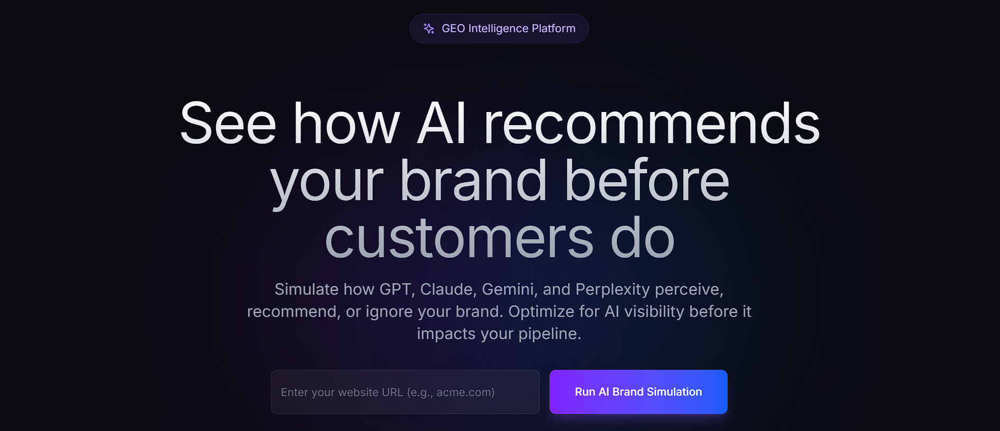
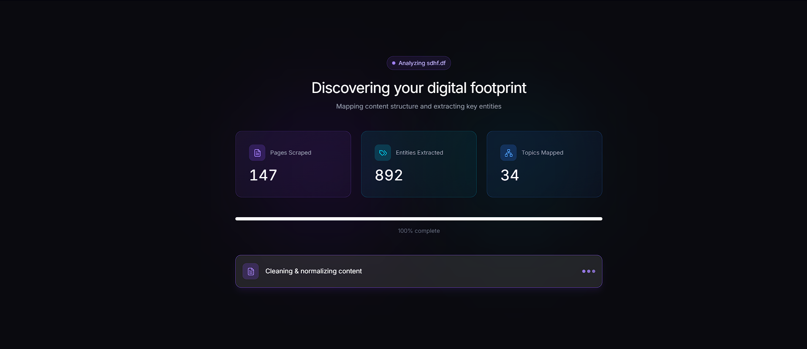
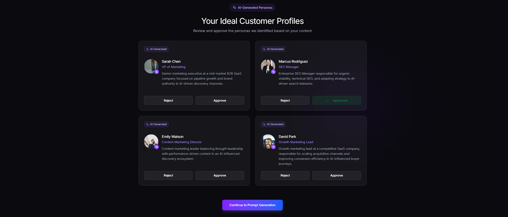
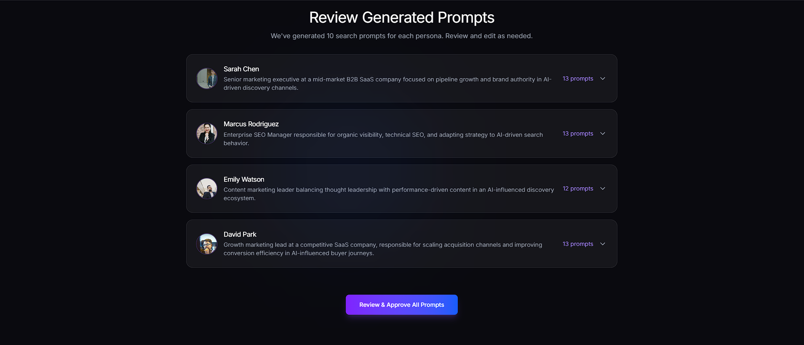
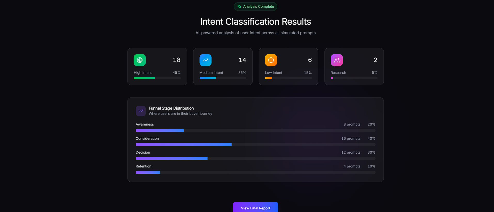

# LLM Brand Influence Monitor

An **AI Visibility & Trust Intelligence Platform** that simulates how Large Language Models (LLMs) perceive, rank, recommend, and implicitly “sell” brands during real user conversations.

This system answers a fundamentally new question that traditional Search Engine Optimization (SEO) tools cannot:

> **When users ask LLMs for advice, which brands shape their beliefs, decisions, and trust—and why?**

---

## What This Platform Does (In One Line)

It **simulates realistic user conversations with LLMs**, analyzes the responses, and builds a **belief-level visibility graph** showing how brands are *ignored, mentioned, trusted, recommended, or compared* across models.

---

## 🚀 Try the MVP

Experience the platform in action with a live MVP:

FE only: 👉 https://geosimulator.netlify.app/

The MVP demonstrates:
- User authentication (signup and login)
- Website submission with automated scraping
- Ideal Customer Profile (ICP) generation
- Simulated LLM conversations based on ICPs
- Brand mention and visibility detection across responses
- Early competitive substitution insights

---

## 📸 Visual Overview

### Complete Workflow

The platform guides you through a 6-step process to analyze your brand's AI visibility:


*Enter your website URL to begin the AI brand simulation*

#### Step 1: Website Scraper

*Automated crawling and content extraction from your website*

#### Step 2: ICP Generation

*AI-generated Ideal Customer Profiles based on your content*

#### Step 3: Prompt Generation

*Realistic user prompts generated for each persona*

#### Step 4: AI Simulation

*Running prompts across GPT, Claude, Gemini, and Perplexity*

#### Step 5: Intent Classification

*Analyzing user intent and funnel stage distribution*

#### Step 6: Report & Analytics

*Comprehensive GEO performance report with competitive insights*

---

## Why This Exists

Traditional SEO measures **page performance**.  
This platform measures **model perception**.

LLMs do not rank pages—they **construct answers**.  
Those answers shape:

- Which brands feel *trustworthy*
- Which brands feel *superior*
- Which brands feel *safe to buy*
- Which brands disappear entirely

The LLM Brand Influence Monitor treats LLMs as a **new distribution channel**, not a search engine.

---

## Core Capabilities

### 1. LLM Visibility Simulation (Not Prompt Scraping)

Instead of checking static prompts, the system:

- Generates **Ideal Customer Profiles (ICPs)**
- Simulates **multi-turn conversations**
- Runs those conversations across multiple LLM providers
- Observes how brands emerge *organically*

This mirrors real-world user behavior.

---

### 2. Brand Presence State Detection

Every brand in every LLM response is classified into exactly **one dominant state**:

```

ignored → mentioned → trusted → recommended → compared

```

| State | Meaning |
|-----|--------|
| ignored | Brand does not appear at all |
| mentioned | Brand name appears without authority |
| trusted | Brand cited as a credible source |
| recommended | Brand suggested with a call-to-action |
| compared | Brand evaluated neutrally vs alternatives |

---

### 3. Belief Formation Analysis

LLMs don’t just mention brands—they **install beliefs**.

Each response installs exactly one primary belief type per brand:

```

truth | superiority | outcome | transaction | identity | social_proof

```

Examples:
- *“This tool is widely trusted”* → social_proof  
- *“Best performing solution”* → superiority  
- *“You should sign up”* → transaction  

---

### 4. Competitive Substitution Mapping

When your brand is absent, **who replaces you?**

The platform measures:
- Share-of-Voice per LLM
- Brand substitution patterns
- Competitive gaps by intent and funnel stage
- Opportunity scores for missing visibility

---

### 5. Knowledge Graph of LLM Perception

All outputs are stored in a **Neo4j knowledge graph**, enabling queries like:

- Which ICPs associate my brand with “outcome” beliefs?
- Which competitors dominate “decision-stage” prompts?
- Which concerns trigger substitution away from my brand?
- Which LLM trusts which brand—and why?

---

## System Architecture Overview

```

┌─────────────────────────────────────────────────────────────────┐
│                           Client Layer                          │
│  Web Dashboard · API Clients · Webhooks                         │
└───────────────┬─────────────────────────────────────────────────┘
                ▼
┌─────────────────────────────────────────────────────────────────┐
│                           API Gateway                           │
│  Auth · Rate Limiting · Routing · Caching                       │
└───────────────┬─────────────────────────────────────────────────┘
                ▼
┌─────────────────────────────────────────────────────────────────┐
│                       Core Services Layer                       │
│                                                                 │
│  Website Scraper → ICP Generator → Conversation Generator       │
│         ↓               ↓                   ↓                   │
│  Prompt Classifier → LLM Simulation → Brand Presence Detector   │
│         ↓               ↓                   ↓                   │
│  Knowledge Graph Builder → Competitive Substitution Engine      │
└───────────────┬─────────────────────────────────────────────────┘
                ▼
┌─────────────────────────────────────────────────────────────────┐
│                            Data Layer                           │
│  PostgreSQL · Neo4j · Redis · Elasticsearch · S3/MinIO          │
└─────────────────────────────────────────────────────────────────┘
                ▼
┌─────────────────────────────────────────────────────────────────┐
│                     External LLM Integrations                   │
│  OpenAI · Gemini · Claude · Perplexity                          │
└─────────────────────────────────────────────────────────────────┘

````

---

## Core Services (Detailed)

### 1. Website Scraper Service

**Purpose:**  
Extracts structured, semantic understanding of a company’s website.

**Capabilities:**
- Full-site recursive crawling
- JavaScript-rendered page support
- Product and service extraction
- Structured metadata parsing
- Hard scrape limits (1/week/domain)

**Tech:** Playwright, Scrapy, BeautifulSoup

---

### 2. ICP Generator Service

**Purpose:**  
Creates 5 realistic Ideal Customer Profiles from website content.

Each ICP includes:
- Demographics
- Job roles
- Pain points
- Goals
- Buying triggers
- Communication preferences

---

### 3. Conversation Generator Service

**Purpose:**  
Simulates how ICPs actually talk to LLMs.

**Output:**
- 10 conversation topics per ICP
- 5 persistent conversation threads per ICP
- Multi-turn follow-ups
- Contextual grounding

Total: **50 realistic conversation flows**

---

### 4. Prompt Classifier Engine

**Purpose:**  
Adds intent metadata to every prompt.

```json
{
  "intent_type": "informational | evaluation | decision",
  "funnel_stage": "awareness | consideration | purchase",
  "buying_signal": 0.0 - 1.0,
  "trust_need": 0.0 - 1.0
}
````

This allows belief analysis by **intent and funnel stage**.

---

### 5. LLM Simulation Layer

**Purpose:**
Runs conversations across multiple LLM providers in parallel.

**Supported Providers:**

* OpenAI (GPT-4 / GPT-4o)
* Google Gemini
* Anthropic Claude
* Perplexity

**Captured Signals:**

* Brand mentions
* Ordering and prominence
* Framing and context
* Commercial vs informational tone

---

### 6. Knowledge Graph Builder (Neo4j)

**Node Types:**

* Brand
* ICP
* Intent
* Concern
* Conversation
* BeliefType

**Edge Examples:**

* `RANKS_FOR`
* `INSTALLS_BELIEF`
* `HAS_CONCERN`
* `MENTIONS`

This graph is the **system of record** for LLM perception.

---

## Tech Stack

| Layer      | Technology                       |
| ---------- | -------------------------------- |
| Backend    | Python 3.11, FastAPI             |
| Async Jobs | Celery + Redis                   |
| Databases  | PostgreSQL, Neo4j, Elasticsearch |
| Storage    | S3 / MinIO                       |
| Infra      | Docker, Kubernetes               |
| Monitoring | Prometheus + Grafana             |
| Logging    | ELK Stack                        |

---

## Getting Started

### Prerequisites

* Python 3.11+
* Poetry 1.7+
* Docker & Docker Compose
* PostgreSQL 15+
* Redis 7+
* Neo4j 5+

---

### 1. Clone Repository

```bash
git clone https://github.com/your-org/geo_simulator.git
cd geo_simulator
```

---

### 2. Environment Setup

```bash
cp .env.example .env
```

Minimum required keys:

* `OPENAI_API_KEY`
* `DATABASE_URL`
* `REDIS_URL`
* `NEO4J_URI`

---

### 3. Run with Docker (Recommended)

```bash
docker-compose up -d
docker-compose logs -f api
```

---

### 4. Run Locally (Advanced)

```bash
poetry install
poetry run alembic upgrade head
poetry run uvicorn services.api.app.main:app --reload
poetry run celery -A shared.queue.celery_app worker -l info
poetry run celery -A shared.queue.celery_app beat -l info
```

---

## Service Access

| Service        | URL                                                          |
| -------------- | ------------------------------------------------------------ |
| API Docs       | [http://localhost:8000/docs](http://localhost:8000/docs)     |
| Health Check   | [http://localhost:8000/health](http://localhost:8000/health) |
| Celery Monitor | [http://localhost:5555](http://localhost:5555)               |
| Neo4j Browser  | [http://localhost:7474](http://localhost:7474)               |
| MinIO Console  | [http://localhost:9001](http://localhost:9001)               |

---

## Who This Is For

* SaaS founders optimizing LLM discovery
* Growth and SEO teams adapting to AI search
* Brand strategists tracking trust signals
* Agencies managing AI visibility for clients
* Researchers studying LLM persuasion dynamics

---

## License

MIT License

---

## Final Note

This project treats LLMs as **decision-making intermediaries**, not search engines.

If SEO optimized for pages,
this system optimizes for **beliefs**.